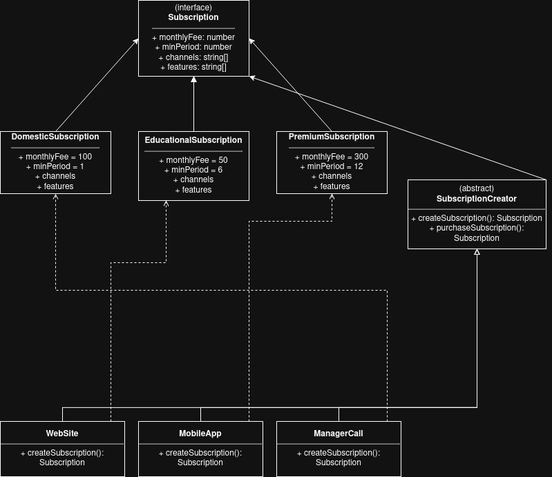

# Завдання 1: Фабричний метод (Factory Method)

Цей проєкт демонструє використання патерну **Factory Method** для створення різних типів підписок (`DomesticSubscription`, `EducationalSubscription`, `PremiumSubscription`) різними методами (`WebSite`, `MobileApp`, `ManagerCall`).

## Як запустити
Для запуску скрипта (із кореня проєкту) виконайте команду:
```bash
npx tsx src/task1/index.ts
```

## Приклад виконання
```text
EducationalSubscription {
  monthlyFee: 50,
  minPeriod: 6,
  channels: [ 'Discovery', 'National Geographic', 'History' ],
  features: [ 'Documentary library', 'No ads' ]
}
PremiumSubscription {
  monthlyFee: 300,
  minPeriod: 12,
  channels: [ 'HBO', 'Netflix Original', 'Sports' ],
  features: [ '4K quality', 'Exclusive content', 'Multiple devices' ]
}
DomesticSubscription {
  monthlyFee: 100,
  minPeriod: 1,
  channels: [ '1+1', 'ICTV', 'Novy Kanal' ],
  features: [ 'HD quality' ]
}
```

## Діаграма класів

