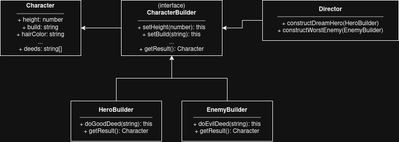

# Завдання 5: Будівельник (Builder)

Цей проєкт демонструє використання патерну **Builder** із текучим інтерфейсом (fluent interface) для створення та конструювання об'єктів ігрових персонажів: Героя та Ворога.

## Як запустити
Для запуску скрипта (із кореня проєкту) виконайте команду:
```bash
npx tsx src/task5/index.ts
```

## Приклад виконання
```text
Hero:
Character {
  height: 180,
  build: 'Athletic',
  hairColor: 'Blonde',
  eyeColor: 'Blue',
  clothing: 'Shining Armor',
  inventory: [ 'Excalibur', 'Shield of Light' ],
  deeds: [ 'Good: Saved the village' ]
}

Enemy:
Character {
  height: 200,
  build: 'Muscular',
  hairColor: 'Black',
  eyeColor: 'Red',
  clothing: 'Dark Cloak',
  inventory: [ 'Cursed Blade' ],
  deeds: [ 'Evil: Stole the ancient artifact' ]
}
```

## Діаграма класів

