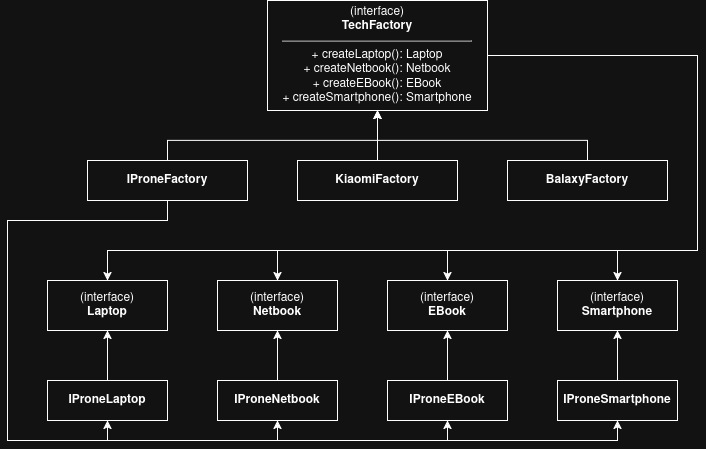

# Завдання 2: Абстрактна фабрика (Abstract Factory)

Цей проєкт демонструє використання патерну **Abstract Factory** для створення серії пристроїв (`Laptop`, `Netbook`, `EBook`, `Smartphone`) від різних брендів (`IProne`, `Kiaomi`, `Balaxy`).

## Як запустити
Для запуску скрипта (із кореня проєкту) виконайте команду:
```bash
npx tsx task2/index.ts
```

## Приклад виконання
```text
Testing IProneFactory:
IProne Laptop
IProne Netbook
IProne EBook
IProne Smartphone

Testing KiaomiFactory:
Kiaomi Laptop
Kiaomi Netbook
Kiaomi EBook
Kiaomi Smartphone

Testing BalaxyFactory:
Balaxy Laptop
Balaxy Netbook
Balaxy EBook
Balaxy Smartphone
```

## Діаграма класів

